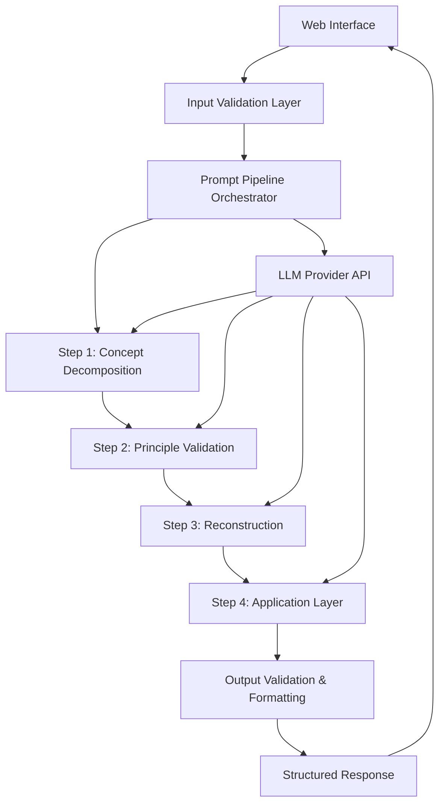

# Design Document: Concept Decomposition Tool

## Overview

The Concept Decomposition Tool is a deterministic learning engine built as a Next.js web application that transforms concepts into structured, principle-based explanations. The system uses a fixed 4-step prompt pipeline to ensure consistent, educational output that challenges assumptions and builds understanding from first principles.

The architecture prioritizes determinism over creativity, using structured inputs (no free-text prompting) and a rigid output contract to produce reliable educational content. The system processes concepts through domain-specific pipelines while maintaining consistent structural formatting across all explanations.

## Architecture

### High-Level Architecture



### System Components

**Frontend (Next.js Client)**
- Structured input form with domain/depth selectors
- Real-time validation and user feedback
- Structured output renderer with section-based display
- No authentication or data persistence for MVP

**Backend (Next.js API Routes)**
- Input validation and sanitization
- Prompt pipeline orchestration
- LLM API integration with structured outputs
- Response validation and error handling

**External Dependencies**
- OpenAI API for language model processing
- JSON Schema validation for structured outputs

## Components and Interfaces

### Input Interface Component

```typescript
interface ConceptInput {
  conceptName: string;           // Required, non-empty
  domain: 'tech' | 'business' | 'education' | 'general';
  depthMode: 'short' | 'exhaustive';
}

interface HiddenDefaults {
  audience: 'students/self-learners';
  outputStyle: 'deterministic';
  teachingMode: 'first-principles';
}
```

### Prompt Pipeline Interface

```typescript
interface PipelineStep {
  stepNumber: 1 | 2 | 3 | 4;
  stepName: string;
  prompt: string;
  temperature: number;          // Fixed low value for consistency
  maxTokens: number;
  responseSchema: JSONSchema;
}

interface PipelineResult {
  stepResults: StepResult[];
  finalOutput: StructuredOutput;
  processingTime: number;
  validationErrors?: string[];
}
```

### Structured Output Interface

```typescript
interface StructuredOutput {
  conceptDefinition: string;
  firstPrinciples: Principle[];
  reconstruction: ReconstructionStep[];
  examples: Example[];
  useCases: UseCase[];
  scenarios: Scenario[];
  assumptionCheck: AssumptionChallenge[];
}

interface Principle {
  id: string;
  statement: string;
  explanation: string;          // Why, not how
  isIrreducible: boolean;
}

interface Example {
  type: 'trivial' | 'applied';
  description: string;
  principleReferences: string[]; // IDs of principles demonstrated
}

interface AssumptionChallenge {
  misconception: string;
  whyItFails: string;
  violatedPrinciples: string[]; // IDs of principles violated
}
```

### API Route Structure

```typescript
// /api/decompose
interface DecomposeRequest {
  input: ConceptInput;
}

interface DecomposeResponse {
  success: boolean;
  data?: StructuredOutput;
  error?: string;
  processingSteps?: string[];   // For debugging
}
```

## Data Models

### Pipeline Configuration Model

```typescript
interface PipelineConfig {
  steps: {
    conceptDecomposition: {
      prompt: string;
      rules: string[];
      outputFormat: 'bullet-list';
    };
    principleValidation: {
      prompt: string;
      validationCriteria: string[];
      outputFormat: 'cleaned-list';
    };
    reconstruction: {
      prompt: string;
      requirements: string[];
      outputFormat: 'step-by-step';
    };
    applicationLayer: {
      prompt: string;
      components: string[];
      outputFormat: 'structured-sections';
    };
  };
}
```

### Domain-Specific Configurations

```typescript
interface DomainConfig {
  domain: 'tech' | 'business' | 'education' | 'general';
  exampleTypes: string[];
  useCaseCategories: string[];
  commonMisconceptions: string[];
  vocabularyLevel: 'beginner' | 'intermediate' | 'advanced';
}
```

### Validation Schema Model

```typescript
interface ValidationRules {
  conceptName: {
    minLength: number;
    maxLength: number;
    forbiddenPatterns: RegExp[];
  };
  outputStructure: {
    requiredSections: string[];
    minimumExamples: number;
    minimumPrinciples: number;
    maximumAssumptions: number;
  };
}
```

## Prompt Pipeline Design

### Step 1: Concept Decomposition Prompt

**Goal:** Extract irreducible principles only, remove buzzwords and metaphors

**Prompt Template:**
```
Analyze the concept "{conceptName}" in the {domain} domain.

RULES:
- Extract ONLY irreducible principles
- NO teaching explanations yet
- NO examples or applications
- NO buzzwords or metaphors
- Each principle must be fundamental

OUTPUT FORMAT: Bullet list of principles only

CONCEPT: {conceptName}
DOMAIN: {domain}
```

### Step 2: Principle Validation Prompt

**Goal:** Eliminate redundancy, ensure principles are fundamental

**Prompt Template:**
```
Review these principles for the concept "{conceptName}":

{principlesFromStep1}

VALIDATION RULES:
- Each principle must stand alone
- If removed, the concept must break
- No redundancy between principles
- Must be truly fundamental

OUTPUT FORMAT: Cleaned principle list with validation notes

PRINCIPLES TO VALIDATE:
{principlesFromStep1}
```

### Step 3: Reconstruction Prompt

**Goal:** Build concept logically from validated principles

**Prompt Template:**
```
Using ONLY these validated principles, reconstruct "{conceptName}":

{validatedPrinciples}

RECONSTRUCTION RULES:
- Step-by-step logical building
- No domain shortcuts
- No assumed knowledge
- Each step references specific principles

OUTPUT FORMAT: Sequential reconstruction steps

PRINCIPLES:
{validatedPrinciples}
```

### Step 4: Application Layer Prompt

**Goal:** Generate examples, use cases, scenarios, and assumption challenges

**Prompt Template:**
```
Create application layer for "{conceptName}" using these principles:

{validatedPrinciples}

GENERATE:
- Examples (1 trivial, 1 applied for short mode; multiple for exhaustive)
- Use cases (where concept is actually used)
- Scenarios (what happens if assumptions fail)
- Assumption challenges (common misconceptions that violate principles)

DEPTH MODE: {depthMode}
DOMAIN: {domain}

Each item must reference specific principles.

PRINCIPLES:
{validatedPrinciples}
```

## LLM Integration Strategy

### OpenAI Structured Outputs Configuration

Based on research from [OpenAI's structured outputs documentation](https://platform.openai.com/docs/guides/structured-outputs), the system will use:

- **Model:** GPT-4o-mini or GPT-4o-2024-08-06 for structured output support
- **Response Format:** `json_schema` with strict mode enabled
- **Temperature:** 0.1 (low for consistency)
- **Schema Validation:** JSON Schema enforcement for all pipeline steps

### Pipeline Orchestration

```typescript
class PipelineOrchestrator {
  async executePipeline(input: ConceptInput): Promise<StructuredOutput> {
    const step1Result = await this.executeStep1(input);
    const step2Result = await this.executeStep2(step1Result);
    const step3Result = await this.executeStep3(step2Result);
    const step4Result = await this.executeStep4(step3Result, input.depthMode);
    
    return this.validateAndFormat(step4Result);
  }
  
  private async executeStep(
    stepConfig: PipelineStep,
    context: any
  ): Promise<StepResult> {
    // OpenAI API call with structured output schema
    // Error handling and retry logic
    // Response validation
  }
}
```

### Error Handling and Retry Logic

- **Validation Failures:** Regenerate only missing sections
- **API Failures:** Exponential backoff with 3 retry attempts
- **Schema Violations:** Automatic correction prompts
- **Timeout Handling:** Graceful degradation with partial results

## Frontend Component Architecture

### Form Component Design

Based on research from React Hook Form and TypeScript validation patterns:

```typescript
interface ConceptFormProps {
  onSubmit: (data: ConceptInput) => Promise<void>;
  isLoading: boolean;
}

const ConceptForm: React.FC<ConceptFormProps> = ({ onSubmit, isLoading }) => {
  const { register, handleSubmit, formState: { errors } } = useForm<ConceptInput>({
    resolver: zodResolver(conceptInputSchema)
  });
  
  return (
    <form onSubmit={handleSubmit(onSubmit)}>
      <ConceptNameInput {...register('conceptName')} />
      <DomainSelector {...register('domain')} />
      <DepthModeSelector {...register('depthMode')} />
      <SubmitButton disabled={isLoading} />
    </form>
  );
};
```

### Output Renderer Component

```typescript
interface OutputRendererProps {
  output: StructuredOutput;
  depthMode: 'short' | 'exhaustive';
}

const OutputRenderer: React.FC<OutputRendererProps> = ({ output, depthMode }) => {
  return (
    <div className="structured-output">
      <ConceptDefinitionSection definition={output.conceptDefinition} />
      <FirstPrinciplesSection principles={output.firstPrinciples} />
      <ReconstructionSection steps={output.reconstruction} />
      <ExamplesSection examples={output.examples} depthMode={depthMode} />
      <UseCasesSection useCases={output.useCases} />
      <ScenariosSection scenarios={output.scenarios} depthMode={depthMode} />
      <AssumptionCheckSection challenges={output.assumptionCheck} />
    </div>
  );
};
```

## Correctness Properties

*A property is a characteristic or behavior that should hold true across all valid executions of a system—essentially, a formal statement about what the system should do. Properties serve as the bridge between human-readable specifications and machine-verifiable correctness guarantees.*

### Property 1: Complete Output Structure
*For any* valid concept input, the system should generate output containing all required sections: concept definition (non-circular), first principles (irreducible, explaining "why"), linear reconstruction, examples (at least one trivial and one applied), use cases (specific applications), scenarios (assumption failures), and assumption challenges (common misconceptions with principle-based explanations).
**Validates: Requirements 2.1, 2.2, 2.3, 2.4, 2.5, 2.6, 2.7**

### Property 2: Pipeline Execution Order
*For any* concept input, the system should execute the 4-step pipeline in strict order: Step 1 (Concept Decomposition) → Step 2 (Principle Validation) → Step 3 (Reconstruction) → Step 4 (Application Layer), with each step using output from the previous step and no user prompt injection allowed.
**Validates: Requirements 4.1, 4.2, 4.3, 4.4, 4.5**

### Property 3: Principle Quality and Traceability
*For any* generated concept explanation, each principle should be irreducible (concept breaks if removed), explain "why" not "how", and every example, scenario, and assumption challenge should trace back to at least one specific principle.
**Validates: Requirements 2.2, 4.6, 6.1, 6.2**

### Property 4: Depth Mode Differentiation
*For any* concept input, short mode should produce exactly one example and one scenario with compact principles, while exhaustive mode should produce multiple examples and scenarios with deeper assumption challenges, but both modes should maintain identical structural format.
**Validates: Requirements 3.1, 3.2, 3.3**

### Property 5: Domain-Appropriate Content Generation
*For any* concept input, the system should generate examples, use cases, and scenarios that are relevant to the selected domain (tech/business/education/general) while maintaining the same structural format across all domains.
**Validates: Requirements 7.1, 7.2, 7.3, 7.4, 7.5**

### Property 6: Assumption Challenge Quality
*For any* concept input, assumption challenges should identify plausible misconceptions that violate at least one first principle, explain why they fail at the principle level, and explicitly reference which specific principles are violated.
**Validates: Requirements 5.1, 5.2, 5.3, 5.4**

### Property 7: Error Recovery and Regeneration
*For any* incomplete output (missing required sections), the system should regenerate only the missing sections while preserving existing valid content.
**Validates: Requirements 2.8**

### Property 8: Input Validation and Security
*For any* user input, the system should validate structured inputs (concept name, domain selection, depth mode) and prevent prompt injection during pipeline execution while maintaining fixed temperature settings and schema validation.
**Validates: Requirements 4.5, 6.4**

### Property 9: Complete User Flow
*For any* valid structured input (concept name + domain + depth mode), the system should display visual feedback during processing and return readable structured output without requiring authentication or storing user data.
**Validates: Requirements 8.3, 8.6**

## Error Handling

### Input Validation Errors
- **Empty Concept Name:** Return validation error with specific field requirement
- **Invalid Domain/Depth Selection:** Return validation error with available options
- **Malformed Requests:** Return 400 status with descriptive error message

### Pipeline Processing Errors
- **LLM API Failures:** Implement exponential backoff with 3 retry attempts
- **Timeout Errors:** Return partial results with indication of incomplete processing
- **Schema Validation Failures:** Automatically trigger section regeneration
- **Missing Output Sections:** Regenerate only missing sections using targeted prompts

### System-Level Errors
- **Rate Limiting:** Implement request queuing with user feedback
- **Service Unavailability:** Return 503 status with retry-after header
- **Memory/Resource Limits:** Implement graceful degradation with simplified output

### Error Response Format
```typescript
interface ErrorResponse {
  success: false;
  error: {
    code: string;
    message: string;
    details?: any;
    retryable: boolean;
  };
  partialData?: Partial<StructuredOutput>;
}
```

## Testing Strategy

### Dual Testing Approach

The system requires both unit testing and property-based testing to ensure comprehensive coverage:

**Unit Tests** verify specific examples, edge cases, and error conditions:
- Input validation with various invalid inputs
- Pipeline step execution with known concept examples
- Error handling scenarios (API failures, timeouts, malformed responses)
- Component rendering with specific props
- Integration between frontend and API routes

**Property-Based Tests** verify universal properties across all inputs:
- Generate random valid concept inputs and verify complete output structure
- Test pipeline execution order with various concept types
- Validate principle quality and traceability across domains
- Verify depth mode differences with same concepts
- Test domain-appropriate content generation with random concepts

### Property-Based Testing Configuration

**Testing Library:** fast-check (JavaScript/TypeScript property-based testing)
**Test Configuration:** Minimum 100 iterations per property test
**Test Tagging:** Each property test must reference its design document property

**Example Property Test Structure:**
```typescript
// Feature: concept-decomposition-tool, Property 1: Complete Output Structure
test('should generate complete output structure for any valid concept', () => {
  fc.assert(fc.property(
    conceptInputGenerator(),
    async (input) => {
      const result = await decomposeAPI(input);
      expect(result.data).toHaveProperty('conceptDefinition');
      expect(result.data).toHaveProperty('firstPrinciples');
      expect(result.data).toHaveProperty('reconstruction');
      expect(result.data).toHaveProperty('examples');
      expect(result.data).toHaveProperty('useCases');
      expect(result.data).toHaveProperty('scenarios');
      expect(result.data).toHaveProperty('assumptionCheck');
      
      // Validate content quality
      expect(result.data.examples.length).toBeGreaterThanOrEqual(2);
      expect(result.data.examples.some(e => e.type === 'trivial')).toBe(true);
      expect(result.data.examples.some(e => e.type === 'applied')).toBe(true);
    }
  ), { numRuns: 100 });
});
```

### Smart Test Data Generation

**Concept Input Generator:**
```typescript
const conceptInputGenerator = () => fc.record({
  conceptName: fc.string({ minLength: 3, maxLength: 50 })
    .filter(s => s.trim().length > 0),
  domain: fc.constantFrom('tech', 'business', 'education', 'general'),
  depthMode: fc.constantFrom('short', 'exhaustive')
});
```

**Domain-Specific Concept Generator:**
```typescript
const domainConceptGenerator = (domain: string) => {
  const conceptsByDomain = {
    tech: ['algorithm', 'API', 'database', 'encryption', 'framework'],
    business: ['profit', 'market fit', 'value proposition', 'supply chain'],
    education: ['learning', 'assessment', 'curriculum', 'pedagogy'],
    general: ['time', 'energy', 'systems', 'communication', 'leadership']
  };
  
  return fc.constantFrom(...conceptsByDomain[domain]);
};
```

### Integration Testing

**API Route Testing:**
- Test complete request/response cycle with various inputs
- Verify error handling with malformed requests
- Test rate limiting and timeout scenarios
- Validate response schema compliance

**Frontend Integration:**
- Test form submission with valid/invalid inputs
- Verify loading states during processing
- Test output rendering with various response structures
- Validate accessibility compliance

### Performance Testing

**Response Time Validation:**
- Pipeline execution should complete within 30 seconds for short mode
- Pipeline execution should complete within 60 seconds for exhaustive mode
- API responses should include processing time metrics

**Resource Usage Monitoring:**
- Memory usage should remain stable across multiple requests
- No memory leaks during extended usage sessions
- Graceful handling of concurrent requests