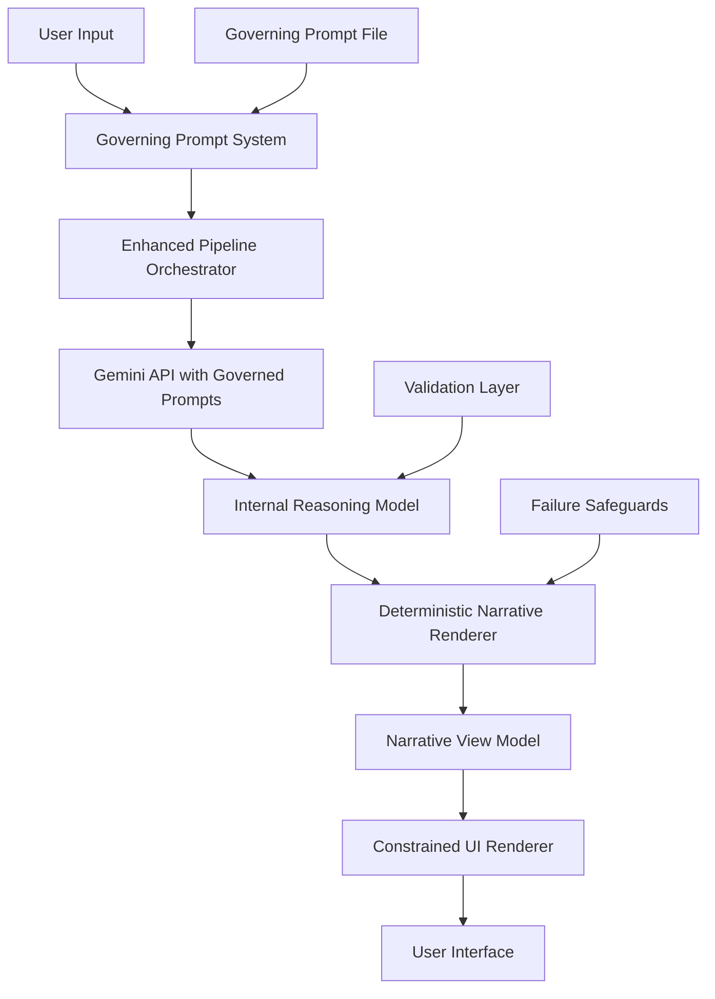

# Design Document

## Overview

This design implements a systematic refactoring of the Gemini-based concept explanation application to enforce first-principles correctness through immutable prompt governance, strict data model separation, and deterministic narrative rendering. The architecture ensures educational content maintains logical integrity by preventing hallucination and enforcing derivability from stated principles.

The refactoring transforms the current system from a direct prompt-to-UI pipeline into a governed, two-layer architecture where internal reasoning models are deterministically converted to narrative presentations without allowing UI components to corrupt or invent content.

## Architecture

### High-Level Architecture



### Core Architectural Principles

1. **Immutable Governance**: All LLM interactions governed by unchangeable first-principles constraints
2. **Data Model Separation**: Clear boundary between internal reasoning and presentation models
3. **Deterministic Rendering**: Pure functions convert internal models to narrative without randomness
4. **Failure Over Fabrication**: System fails gracefully rather than inventing content
5. **UI as Reader**: Interface displays content without interpretation or enhancement

## Components and Interfaces

### 1. Governing Prompt System

**Location**: `/llm/governingPrompt.ts`

```typescript
export const GOVERNING_PROMPT: string;
```

**Responsibilities**:
- Define immutable first-principles constraints
- Enforce WHY-not-HOW reasoning
- Prevent hallucination through derivability requirements
- Enable self-checking mechanisms

**Key Constraints**:
- Must be prepended to every Gemini API call
- Cannot be summarized, merged, or conditionally applied
- Treated as system policy, not task instruction
- Contains necessity test, no-hallucination rule, derivability enforcement

### 2. Enhanced Pipeline Orchestrator

**Location**: `src/lib/pipeline/orchestrator.ts`

```typescript
interface EnhancedPipelineOrchestrator {
  runPipeline(input: ConceptInput): Promise<InternalReasoningModel>;
  private prependGoverningPrompt(taskPrompt: string): string;
  private validateGoverningCompliance(prompt: string): boolean;
}
```

**Responsibilities**:
- Prepend governing prompt to all task-specific prompts
- Validate prompt compliance with governing constraints
- Orchestrate the 4-step reasoning pipeline
- Return structured internal reasoning model

**Changes from Current**:
- All prompts now governed by immutable constraints
- Returns `InternalReasoningModel` instead of `StructuredOutput`
- Added prompt compliance validation
- Enhanced error handling for governance violations

### 3. Data Models

#### Internal Reasoning Model

```typescript
interface InternalReasoningModel {
  definition: string;
  validatedPrinciples: string[];
  reconstructionSteps: ReconstructionStep[];
  examples: AnchoredExample[];
  useCases: string[];
  scenarios: string[];
  assumptionChallenges: AnchoredChallenge[];
}

interface ReconstructionStep {
  step: string;
  principleReferences: number[]; // References to principle indices
}

interface AnchoredExample {
  example: string;
  principleReferences: number[]; // Must reference specific principles
}

interface AnchoredChallenge {
  challenge: string;
  principleViolated: number; // Must reference specific principle
  explanation: string;
}
```

#### Narrative View Model

```typescript
interface NarrativeViewModel {
  paragraphs: NarrativeParagraph[];
}

interface NarrativeParagraph {
  content: string;
  type: 'definition' | 'reconstruction' | 'example' | 'challenge';
  order: number;
}
```

**Key Separation Rules**:
- Internal model contains all reasoning structure and principle anchoring
- Narrative model contains only ordered paragraphs for rendering
- UI components can ONLY access narrative model
- No UI logic may modify, reorder, or invent content

### 4. Deterministic Narrative Renderer

**Location**: `src/lib/narrative/renderer.ts`

```typescript
interface NarrativeRenderer {
  renderNarrative(internal: InternalReasoningModel): NarrativeViewModel;
}
```

**Core Function Signature**:
```typescript
function renderNarrative(internalModel: InternalReasoningModel): NarrativeViewModel
```

**Rendering Rules**:
1. Start with definition as natural opening paragraph
2. Flow into reconstruction logic without section headings
3. Use connective language ("For this to hold...", "This requires that...")
4. Introduce examples only after logical concept building
5. Present assumption challenges last as corrections
6. Avoid section titles unless paragraph length requires them
7. Pure function - no randomness, LLM calls, or state dependencies

**Content Flow Logic**:
```
Definition → Reconstruction Flow → Examples → Assumption Challenges
```

### 5. Constrained UI Components

**Location**: `src/components/narrative/`

```typescript
interface NarrativeDisplay {
  narrativeModel: NarrativeViewModel;
  renderParagraphs(): JSX.Element;
}
```

**UI Constraints**:
- Render ONLY `NarrativeViewModel` content
- Display paragraphs in strict order
- NO structural labels ("Definition", "First Principles", etc.)
- Headings allowed ONLY for readability, not structure exposure
- Act as reader, not explainer
- Never teach beyond provided content

### 6. Failure Safeguards

**Location**: `src/lib/safeguards/`

```typescript
interface FailureSafeguards {
  validateCompleteness(data: any): ValidationResult;
  handleIncompleteData(data: any): SafeguardResult;
  preferFailureOverFabrication(data: any): SafeguardResult;
}

type SafeguardResult = 
  | { type: 'success'; data: NarrativeViewModel }
  | { type: 'partial'; data: NarrativeViewModel; warning: string }
  | { type: 'failure'; error: string };
```

**Safeguard Rules**:
- Never attempt to "fix" incomplete Gemini responses in UI
- Never invent missing sections
- Fail gracefully with clear error states
- Prefer empty/partial output over fabricated content
- Always choose correctness over user experience smoothness

## Data Models

### Current vs. Refactored Data Flow

**Current Flow**:
```
Input → Prompts → Gemini → StructuredOutput → Direct UI Rendering
```

**Refactored Flow**:
```
Input → Governed Prompts → Gemini → InternalReasoningModel → 
Deterministic Renderer → NarrativeViewModel → Constrained UI
```

### Model Transformation Pipeline

1. **Input Processing**: Validate and prepare concept input
2. **Governed Prompt Generation**: Prepend immutable constraints to task prompts
3. **Internal Model Creation**: Structure reasoning with principle anchoring
4. **Narrative Transformation**: Convert to ordered paragraphs deterministically
5. **UI Presentation**: Render narrative without interpretation

### Data Validation Requirements

- All examples must reference specific principles by index
- All assumption challenges must identify violated principles
- Reconstruction steps must maintain logical sequence
- Content must be derivable from stated principles
- No orphaned content without principle anchoring

## Error Handling

### Governance Violation Handling

```typescript
class GovernanceViolationError extends Error {
  constructor(violation: string, prompt: string) {
    super(`Governance violation: ${violation}`);
  }
}
```

**Violation Types**:
- Task prompt contradicts governing constraints
- Missing governing prompt prepending
- Attempt to modify immutable governance rules
- Content not derivable from principles

### Content Validation Errors

```typescript
class ContentValidationError extends Error {
  constructor(issue: string, content: any) {
    super(`Content validation failed: ${issue}`);
  }
}
```

**Validation Failures**:
- Examples without principle anchoring
- Assumption challenges without principle references
- Reconstruction steps out of logical order
- Definition circular or non-derivable

### Rendering Failures

```typescript
class RenderingError extends Error {
  constructor(reason: string, internalModel: any) {
    super(`Cannot render narrative: ${reason}`);
  }
}
```

**Rendering Issues**:
- Content cannot be ordered logically
- Missing required sections for narrative flow
- Principle references cannot be resolved
- Circular dependencies in reconstruction

### Failure Recovery Strategies

1. **Graceful Degradation**: Show partial content with clear warnings
2. **Error State Display**: Clear explanation of what went wrong
3. **No Fabrication**: Never invent content to smooth over errors
4. **User Guidance**: Suggest input modifications for better results

## Testing Strategy

### Unit Testing Approach

**Governing Prompt System**:
- Test immutable prompt prepending
- Verify governance constraint enforcement
- Validate prompt compliance checking

**Data Model Separation**:
- Test internal model structure validation
- Verify UI cannot access internal model
- Validate narrative model generation

**Deterministic Rendering**:
- Test pure function behavior (same input → same output)
- Verify logical content ordering
- Validate connective language insertion

**Failure Safeguards**:
- Test incomplete data handling
- Verify fabrication prevention
- Validate error state generation

### Property-Based Testing Configuration

Using **fast-check** for TypeScript property-based testing with minimum 100 iterations per test.

Each property test tagged with: **Feature: concept-tool-refactoring, Property {number}: {property_text}**

## Correctness Properties

*A property is a characteristic or behavior that should hold true across all valid executions of a system—essentially, a formal statement about what the system should do. Properties serve as the bridge between human-readable specifications and machine-verifiable correctness guarantees.*

### Property 1: Governing Prompt Immutability
*For any* task prompt and system state, the governing prompt must be prepended verbatim to every Gemini API call without modification, summarization, or conditional application.
**Validates: Requirements 1.3, 2.1**

### Property 2: Governing Constraint Enforcement
*For any* task prompt that contradicts governing constraints, the system must reject the prompt or fail rather than allowing the contradiction to proceed.
**Validates: Requirements 1.5, 2.4**

### Property 3: Prompt Composition Purity
*For any* task prompt, the final prompt sent to Gemini must equal exactly [governing_prompt] + [task_prompt] with no additional content injection.
**Validates: Requirements 2.5**

### Property 4: Data Model Access Control
*For any* UI component interaction, the component must only receive narrative view models and never have access to internal reasoning models.
**Validates: Requirements 3.3, 3.4, 3.5, 5.1**

### Property 5: Internal Model Structure Validation
*For any* internal reasoning model, all examples and assumption challenges must reference valid principle indices, and all required fields must be present.
**Validates: Requirements 3.1, 7.1, 7.2**

### Property 6: Narrative Rendering Determinism
*For any* internal reasoning model, the renderNarrative function must produce identical narrative view models when called multiple times (pure function behavior).
**Validates: Requirements 4.1, 4.8**

### Property 7: Content Ordering Preservation
*For any* narrative view model, the content must follow the logical order: definition → reconstruction → examples → assumption challenges.
**Validates: Requirements 4.2, 4.5, 4.6**

### Property 8: Content Addition Prevention
*For any* transformation from internal model to narrative model to UI output, no new factual content may be added beyond connective language.
**Validates: Requirements 4.4, 5.6**

### Property 9: UI Rendering Fidelity
*For any* narrative view model, the UI output must display paragraphs in exact order without structural labels like "Definition", "First Principles", or "Examples".
**Validates: Requirements 5.2, 5.3**

### Property 10: Failure Over Fabrication
*For any* incomplete or invalid data from Gemini, the system must return error states, empty output, or partial output with warnings rather than inventing missing content.
**Validates: Requirements 6.1, 6.2, 6.4, 6.5**

### Property 11: Content Derivability Validation
*For any* content in the internal reasoning model, it must be traceable back to stated principles or be rejected during validation.
**Validates: Requirements 7.4, 7.5**

### Property 12: API Compatibility Preservation
*For any* existing API consumer, the refactored system must maintain compatible endpoint structure, input validation, and response format where not conflicting with new requirements.
**Validates: Requirements 8.1, 8.2, 8.3**

### Property 13: Principle Anchoring Completeness
*For any* example or assumption challenge in the internal model, it must reference at least one valid principle index and the reference must resolve to actual principle content.
**Validates: Requirements 7.1, 7.2**

### Property 14: Logical Sequence Validation
*For any* set of reconstruction steps, they must maintain logical dependency order where each step builds upon previous steps without circular references.
**Validates: Requirements 7.3**

### Property 15: Content Omission Over Violation
*For any* content that cannot be rendered in proper logical order, the narrative renderer must omit the content rather than violate ordering constraints.
**Validates: Requirements 4.9**